# Question 1

1. Construir o triângulo ABC conhecendo os lados b e c (opostos
aos vértices B e C respectivamente) e a mediana mc relativa
ao vértice C. Quantas soluções são possíveis

- solution.:

    Having b, c and mc defined.:

    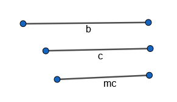

    We can first find the median point of the c segment by using the compass tool on both of it's endpoints, with the radius as itself.

    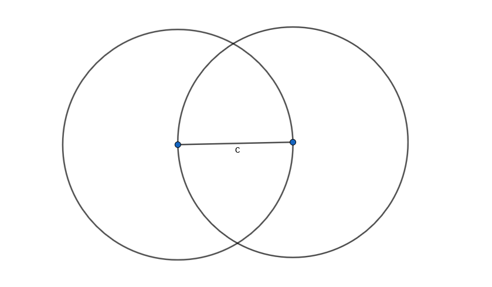

    After that we can draw a segment between the 2 intersection points of the 2 newly drawn circles, we can safely define the distance of both to the ends of the segment c as the same as the lenght of c, due to they being the radius of the compass drawn circles.

    With that, the segment we just drew is the height of an equilateral triangle of side lenght c.

    And that defines H as the center point of the c segment.

    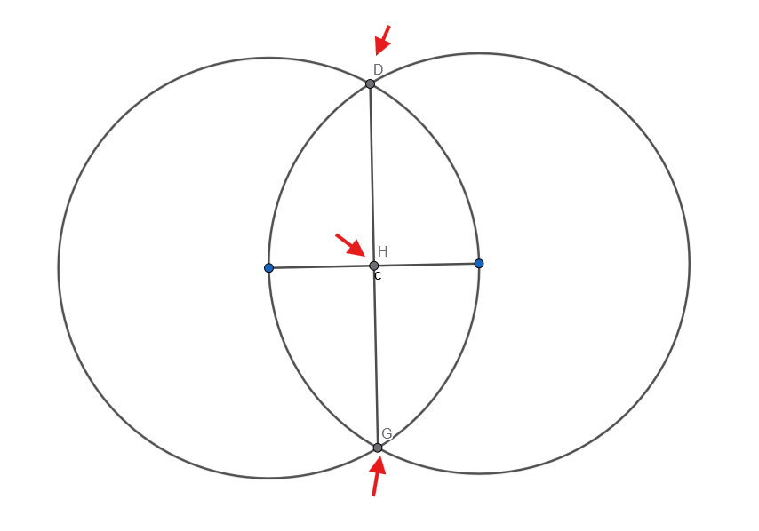

    Again with the compass tool, we can draw 2 new circles.
    The first with radius b and center on one of the end points of the segment c, that we will call as the vertice A.
    The second with radius mc and center on the newly set, point H, the midpoint of C.

    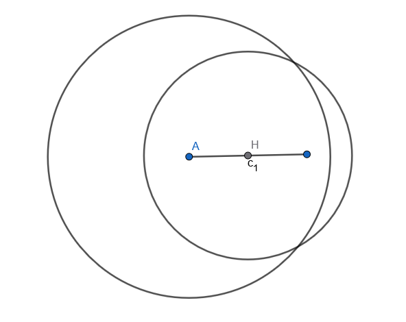

    The intersections of those 2, we can define as the Points I and J, can be set as the 2 possible aliases to the vertice C, as they are at a distance of A equal to the lenght b, and at lenght mc of H.

    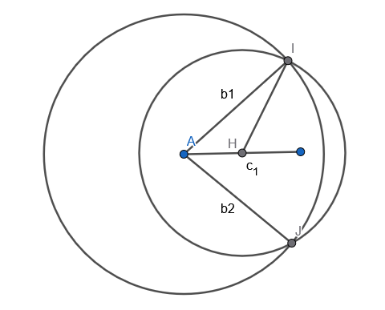

    With that we can define a1 and a2 as possible awnsers.

    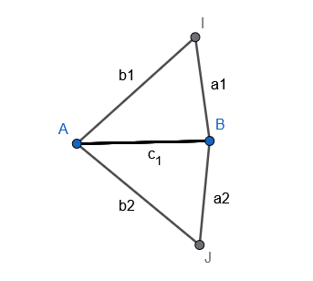

    Although, we can also find 4 others on an 2 dimensional plane, by swapping the vertices A and B

    <small> (need to check if that is possible, or the positions of A and B are locked based on b)</small>
---

# Question 2

2. Construir o triângulo ABC conhecendo os lados b e c (opostos
aos vértices B e C respectivamente) e a mediana ma relativa
ao vértice A.

* solution.:

    Having b, c and mc defined.:

    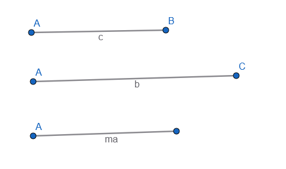

    We can using only a compass and a unmarked ruler extend a segment of same lenght as ma on the same line.
    Giving us the point A'.

    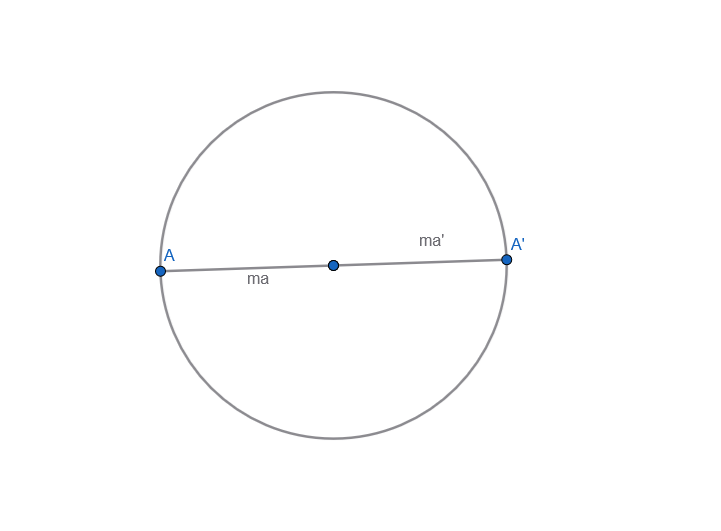

    With that, we can with the compass draw 2 circles, one of lenght b with center at A and one with lenght c with center at A', the intersection of both we can name B1 and B2.
    
    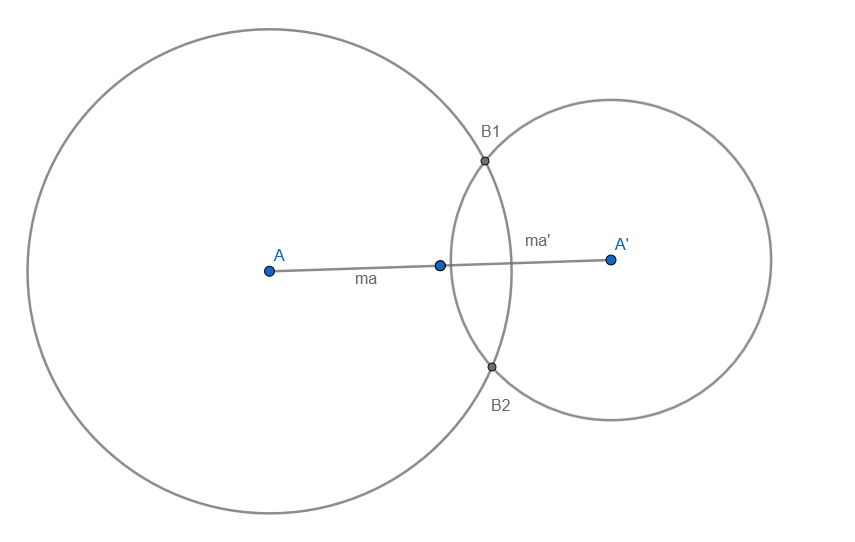

    Doing the same, although now swapping the lenght of the circles at both centers, we can define again the intersection of those 2 circles as C1 and C2.

    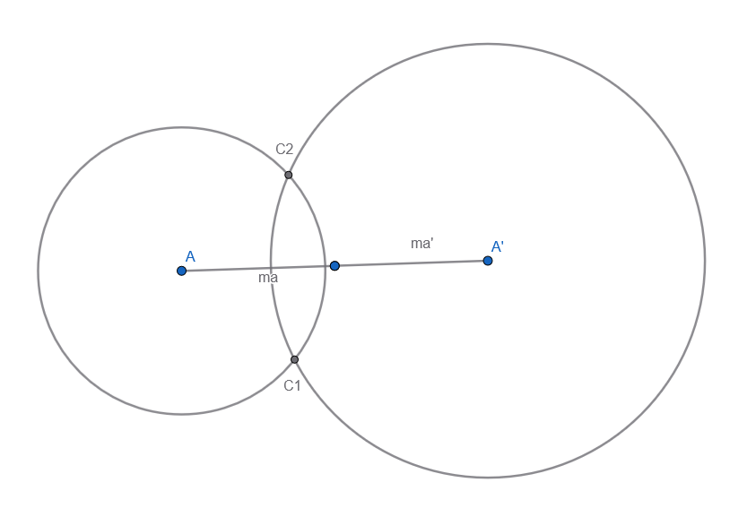

    Chosing a pair of those 4 newly set points so that the segment between the 2 intersects the segment A-A', we have a new point that we can call H.

    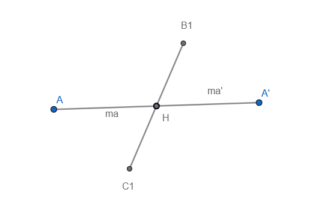

    As we know, the segments A-B1 and A'-C1 being of lenght b, also with A-C1 and A'-B1 being of lenght c, we can for sure define the quadrilateral formed by those 4 points a paralelogram, as the 2 oposite sides are of equal lenght. 
    ([proof here by Opposite Sides Converse Theorem, if it's needed lol](https://study.com/skill/learn/completing-proofs-of-theorems-involving-sides-of-a-parallelogram-explanation.html#:~:text=Opposite%20Sides%20Converse%20Theorem:%20The,the%20quadrilateral%20is%20a%20parallelogram.))

    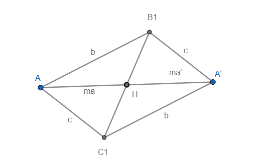

    That makes C1-B1 and A-A' diagonals of a paralalogram, and as such they always bisect each other, and with that, H is the midpoint of B1-C1, making it of lenght a.
    As such, one of the 2 possible ABC triangle with the first defined position of A and ma is A-B1-C1.

    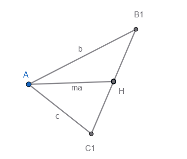

    And the other one being A-B2-C2.

    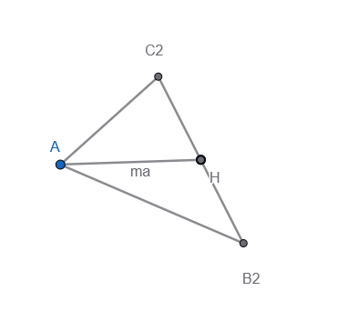

---

# Question 3

3. Prove que um raio de um círculo é perpendicular a uma corda
que não é um diâmetro se, e somente se, ele a divide em dois
segmentos congruentes.

* solution.:

    We can start by breaking the IFF proof into the 2 if->then that makes it.

    1. Prove that if a radius of a circle is perperdicular to a non diameter chord then the former bisects the later.

    2. Prove that if a radius bisects a non diameter chord then the former must be perpendicular to the later.

    Working on the 1st one.:

    We first define any chord on a circle with center A, by picking 2 random points B and C.

    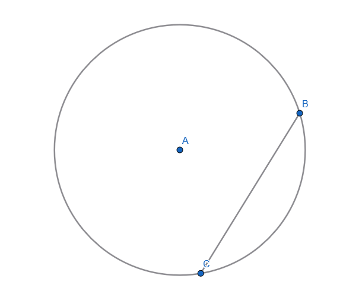

    Tracing a perpendicular line to B-C that passes on A, and definining the point D where it intersects the circle, we have the perpendicular radius A-D.
    
    (A-B-C-D is a kite tbh, the proof could just be that lol)

    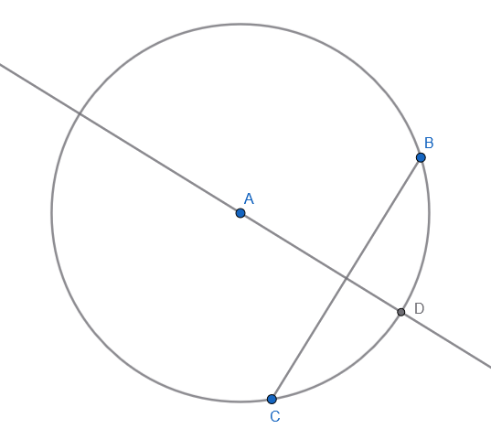

    By naming the point that the radius intersects with the chord as E, we can then build the following 2 right triangles, A-B-E and A-C-E, and due to the nature of A-B and A-C being radius, and such having lenght r, and A-E being a leg of both, we can define the lenght of C-E and B-E as $\sqrt{(AE)^2 + r^2}$, and as they are the same, AD bisects CB for sure, no matter the points B and C chosen (unless they are at the same line of A, bcs that would make it a diameter),

    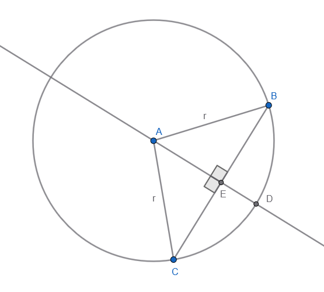

    And now for the 2nd one.:

    <!--
    (just looks like isoceles triangle always being perpendicular with the base, the 2 triangles defined by the intersection are the same, same sides, so same angles, with that the sum of the 2 angles must be 180)
    -->

    Same as the first, we start by defining any chord on a circle with center A, by picking 2 random points B and C.
    As the postulate requires, we also define the point D, the midpoint of the segment BC, and with that we draw the radius that bisects BC by extending AD.

    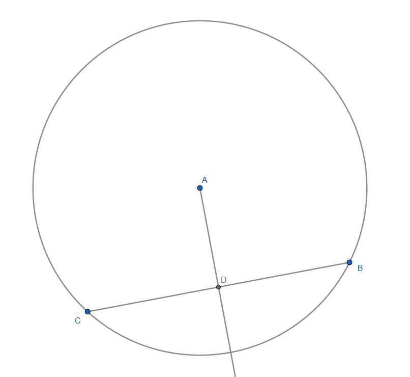

    Defining the lengh of the the segments AB, AC as r, as both are radius of the circle, and the segments CD and BD as x, as both are halves of BC, we can define both ADC and ADB triangles as congruents, as they have share sides of lenghts r, x and AD.
    
    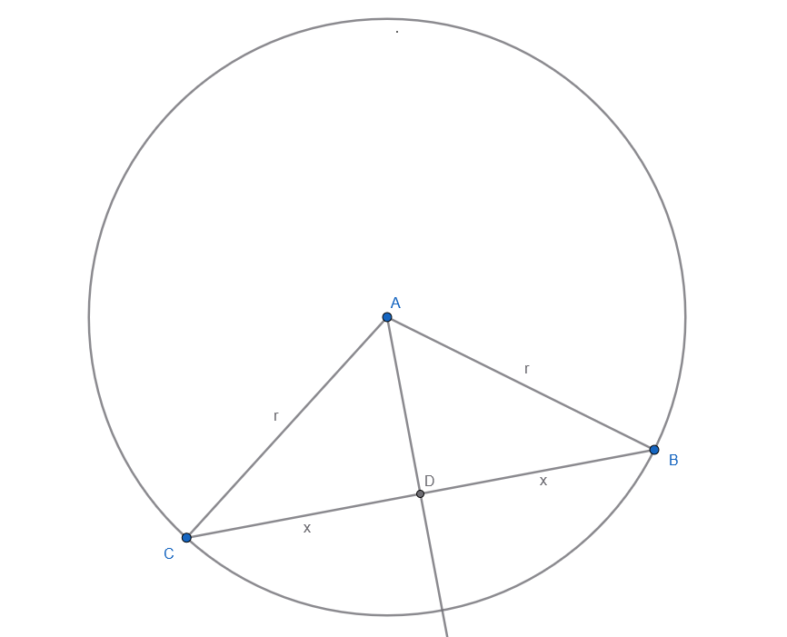

    With that defined we can also extrapolate that the angles ADC and ADB are congruents, as they are part of 2 congruent triangles with matching oposite sides.

    And as D is a point on the segment BC, the sum of both angles ADC and ADB is for sure 180&deg;, so both are right angles, and that makes AD perpendicular to BC no matter the positions of B and C outside of them forming a diameter.

    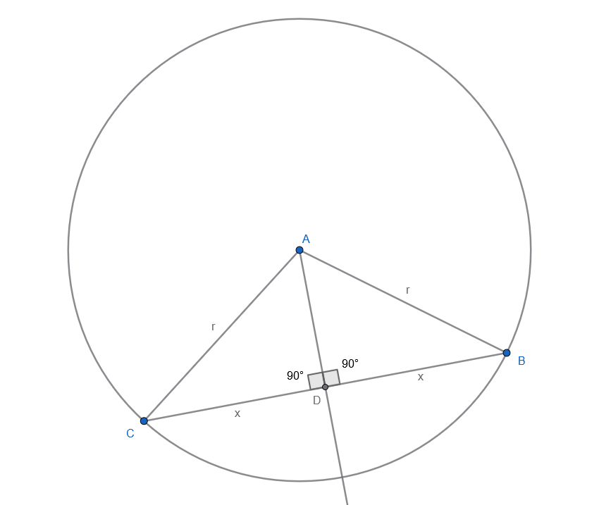

---

# Question 4

4. Prove que se uma reta é tangente a um círculo, então ela é
perpendicular ao raio que liga o centro ao ponto de tangência.

* solution.:

    Tbh, I'm at a loss on how to prove this one with a rule and a compass...
    The shortest distance of a point to a line is tangent to that line.
    If there is a shortest distance than r from the center to the tangent line, it's not tangent, as it would intercept the circle on 2 points.
    BUT FFS HOW DO YOU PROVE THAT WITH CIRCLES AND TRIANGLES?
    AAAAAAAAAAAAAAAAAAAAAAAAAAAAAAAAAAAAAAAAAAA

    Welp, I did find a [proof with circles and triangles by absurdity on yt](https://www.youtube.com/watch?v=IDrRIPLnSn8) but it just seems like a lot of work for something that it's "proved" just by definitons... Wlp, need to check if the definition one is valid on the tests.

---

# Question 5

5. Construir o triângulo ABC conhecendo os lados a e b (respectivamente opostos aos vértices A e B) e a altura ha.

* solution.:

    Having a, b and ha defined.:
    
    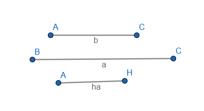

    Define the perpendicular line to ha at H

    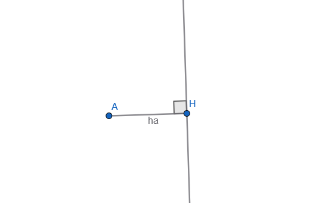

    Mark with the compass the circle of lenght b, and define C1 and C2

    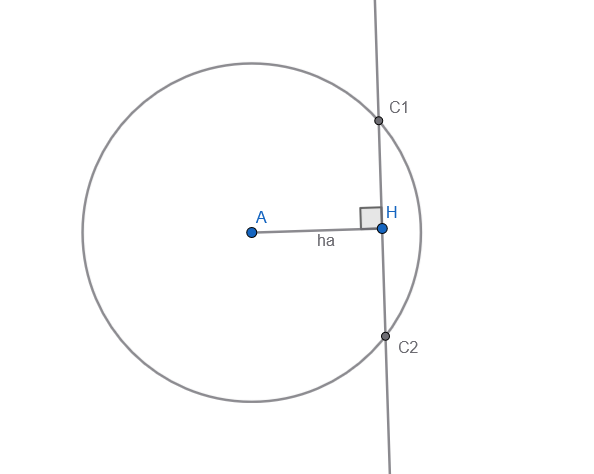

    Focusing on C1 for now, draw the circle with lenght a, and mark B1 at the point it intercepts the perpendicular line to ha, the segment B1C1 is the side a of this triangle.

    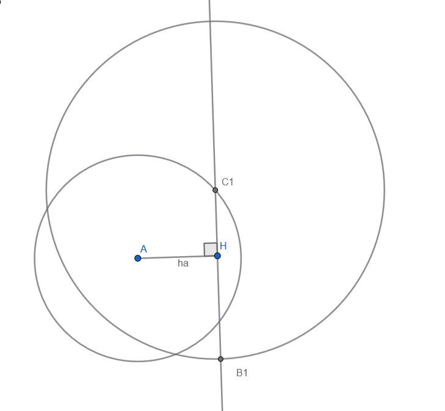

    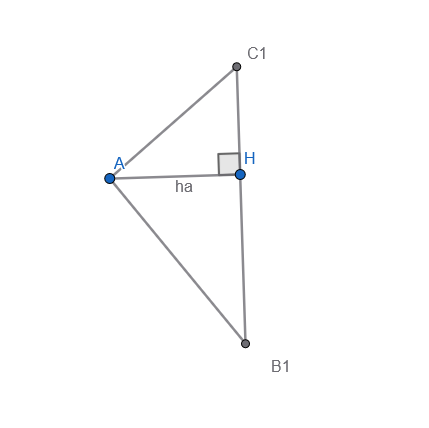

    And we can just do the same for C2

    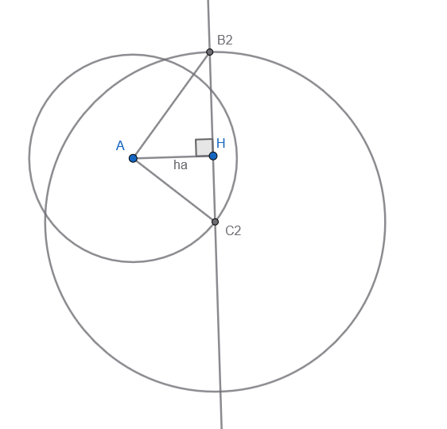

---

# Question 6

6. Construir o triângulo ABC conhecendo os lados b e c e a altura ha.

* solution.:

    Having b, c and ha defined.:

    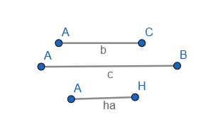

    Same same start as question 5.:

    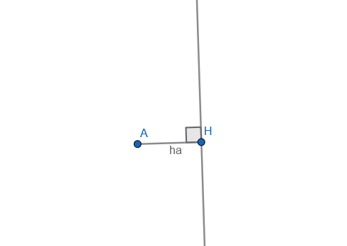

    Although now both the sides share the vertice A, so with a compass we draw 2 circles, one of lenght b and the other of lenght c, and we mark the 4 possible points for vertices C and B as C1,C2,B1,B2

    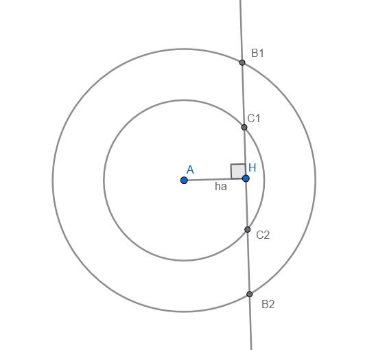

    And as the lenght of a was not given, the triangle can be acute, obtuse or right (if ha is the same lenght as 1 of the given sides), with that we can have up to 4 possible ones with the following permutations.:

    A-B1-C1.:

    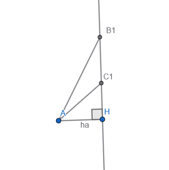

    A-B1-C2.:

    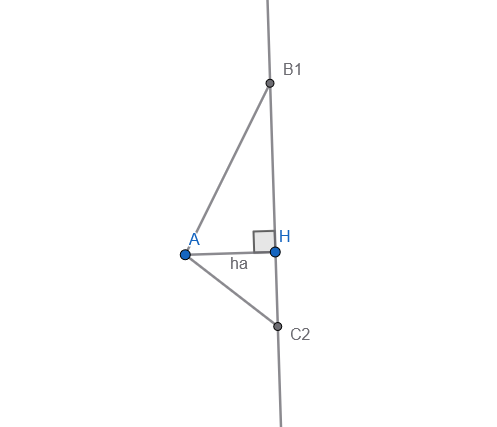

    A-B2-C1.:

    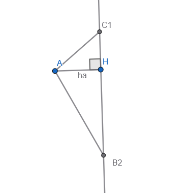

    A-B2-C2.:

    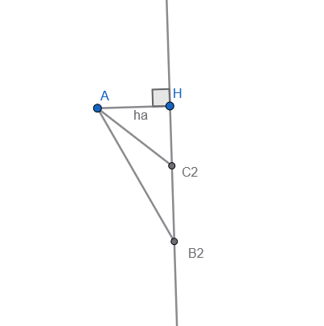

    And in the case where one of the sides is indeed the same size as ha, in this example the b side, there would be only 1 C as it would be a tangent point on a circle of b lenght.:

    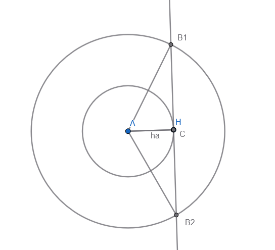

---

# Question 7

7. Dados em posição um círculo C uma reta r, construir um círculo de raio dado tangente a r é tangente exteriormente a C.

* solution.:

    Given the line r (defined by the points A and B) and the circle c (defined by the point C and radius less than the distance between C and r, as if it wasn't it's impossible to build an externally tangent circle to c while it being tangent to r)

    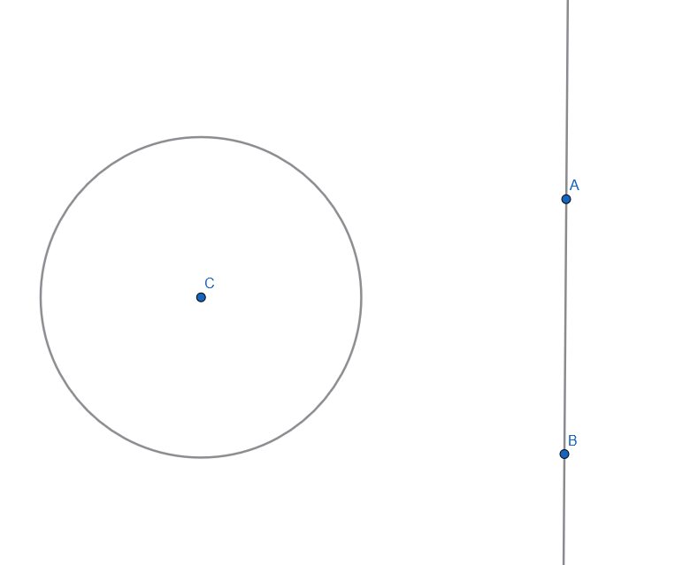

    tbh, it's any circle with a center that is equidistant from the circle c and line r...
    
    easiest example would be this one with center on F, the midpoint between the DE defined on the line perpendicular to r that passes trough C

    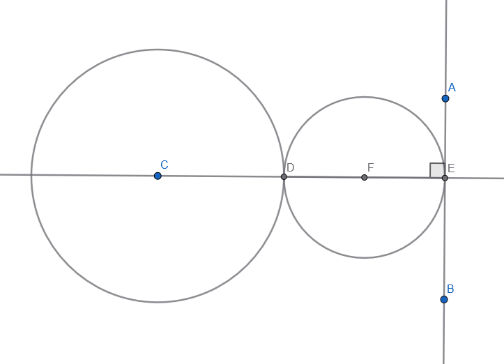

---

# Question 8

8. Usando o fato de que cordas congruentes de um círculo descrevem ângulos inscritos congruentes, construa um triângulo dadas a altura, a mediana e a bissetriz relativas a um mesmo vértice.

* solution.:

    Having the height ha, the median ma and the angle bisector ba, all based on the vertice A, defined as such.:

    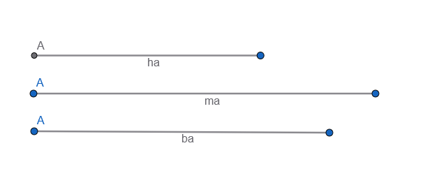

    We can, using ha, define the line where the side a is for sure part of.:

    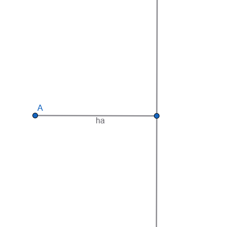

    And with the compass define M1 and M2, the possible median points on it.:

    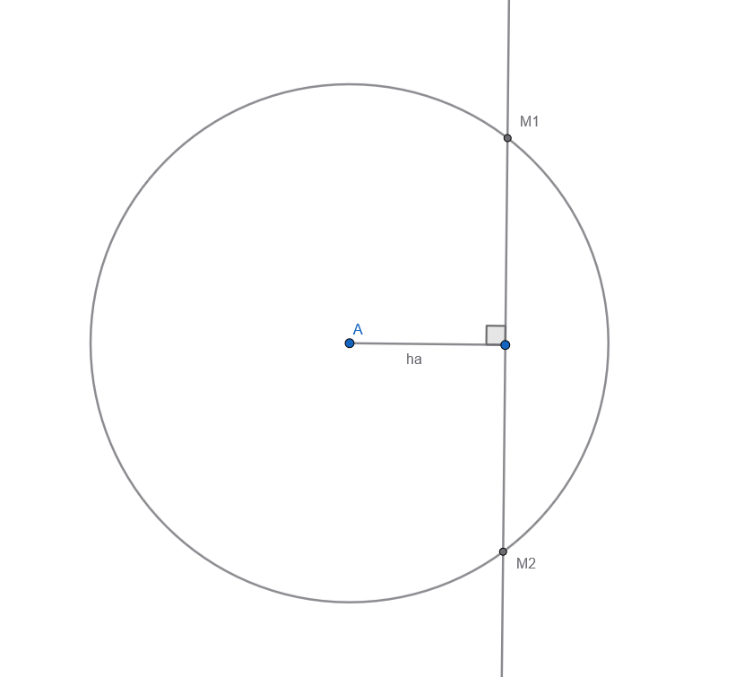

    And also define B1 and B2, the 2 possible points where the angle bisector ba intercepts the side a.:

    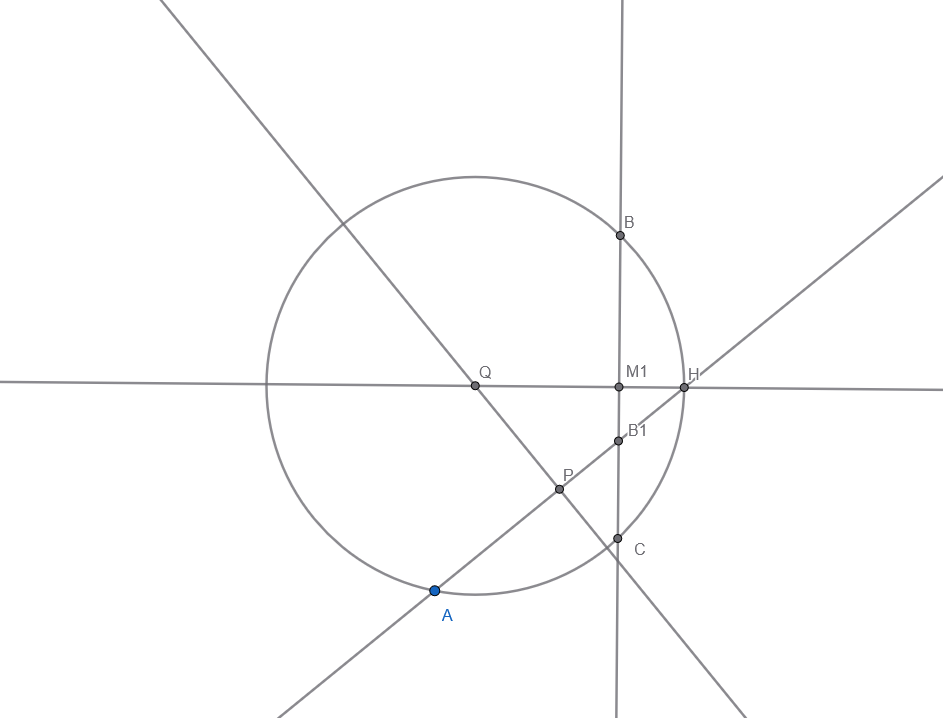