# Question 1

1. Construir o triângulo ABC conhecendo os lados a e b e a
altura ha.

- solution.:

    Given the sides a, b, and the height ha.:

    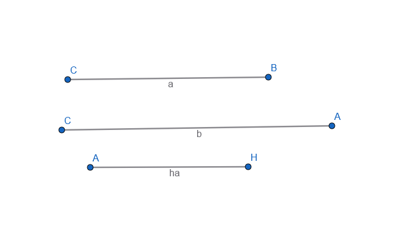

    With a compass and ruler we find the possible vertices.:

    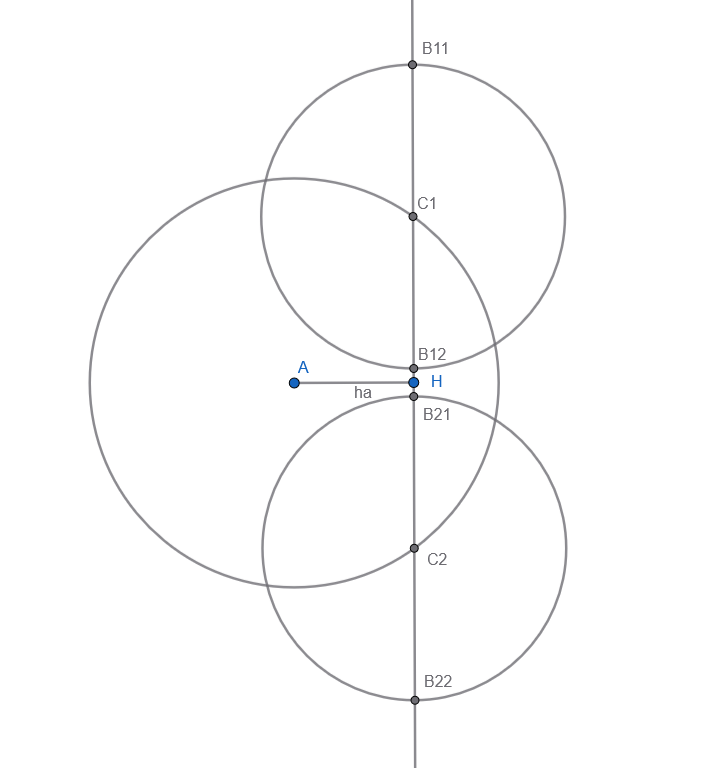

    And we find the 4 possible triangles.:

    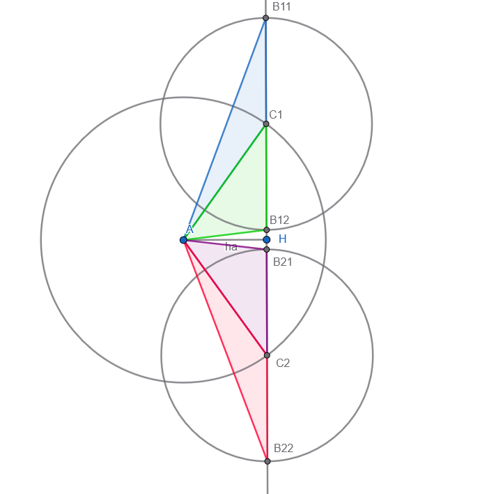

---

# Question 2

2. Construir o triângulo ABC conhecendo os lados b e c e a altura ha.

- solution.:

    Given the sides c, b, and the height ha.:

    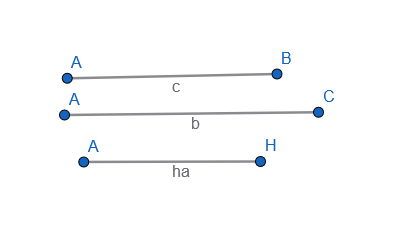

    With a compass and ruler we find the possible vertices and the 4 possible triangles.:

    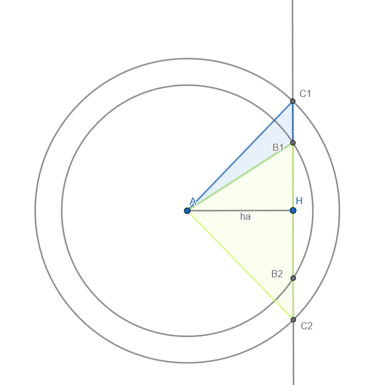

    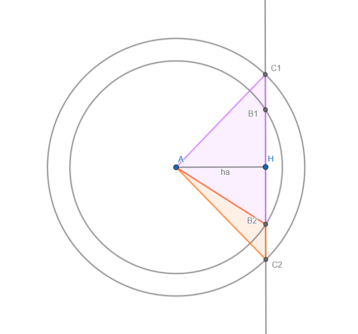

---

# Question 3

3. Construir o triângulo ABC conhecendo o lado a, a mediana ma relativa ao vértice A e o ângulo Â.

- solution.:

    Given the side a, the median ma and the angle Â.:

    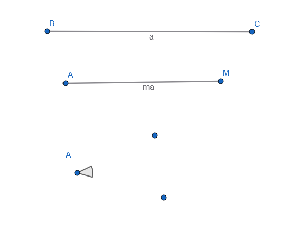

    We can ddefine the circunference where the 2 points that could be A reside.

    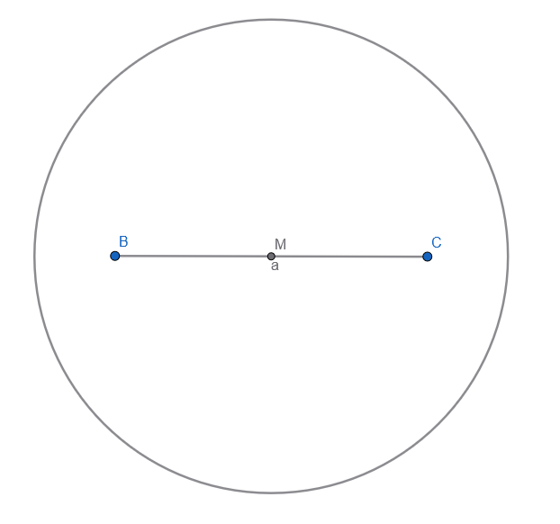

    After that we find the complement of Â, that we will call cÂ.:

    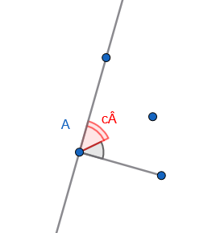

    Using cÂ, we find a point Y, where the line created by c on B with relation to BC intersects a perpendicular to BC passing trough C.

    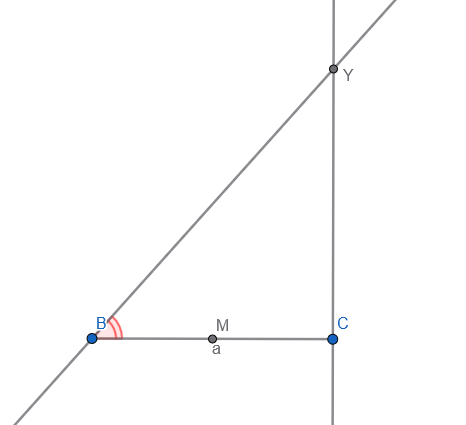

    Using the perpendicular bisectors of BC and CY, we find the circumcircle of BYC.:

    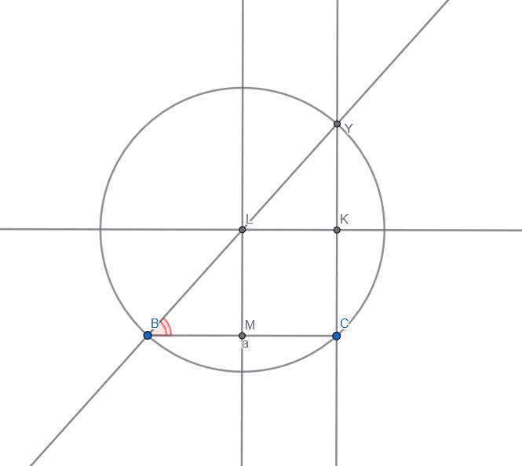

    As ^BCY is a right angle, and ^YBC is the complement of ^A, we can define that ^BYC == ^A

    using that, and with the circuference that maps the points of possibles As, we can map 2 of the 4 possible ones by the intersection of the circumcircle of BYC.:

    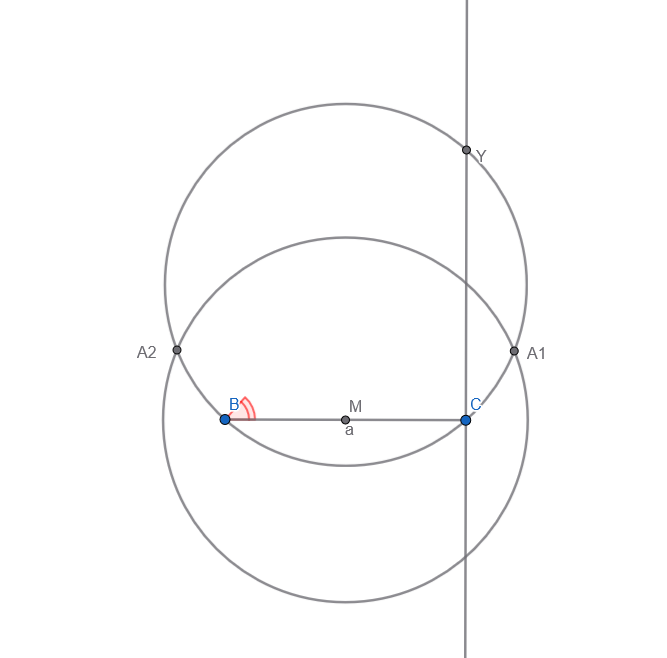

    and as those 3 angles see the same arc and are on the circunference, they are congruents

    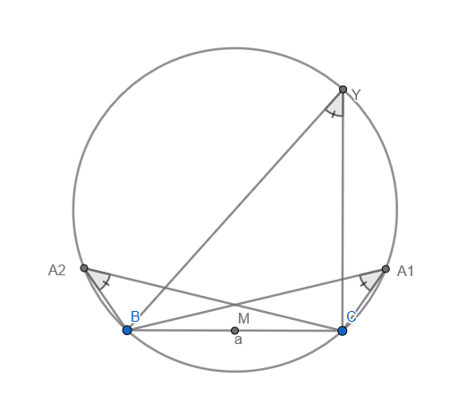

    and we have 2 of the 4 possible positions for A, to get the other 2 just reflect Y based on BC and map the other 2, not gonna do that now bcs, meh...

---

# Question 4

4. Construir o triângulo ABC conhecendo o lado a, a soma b + c dos outros dois lados e o ângulo ˆA.

- solution.:

    Given the side a, the sum of b,c and the angle ^A.:

    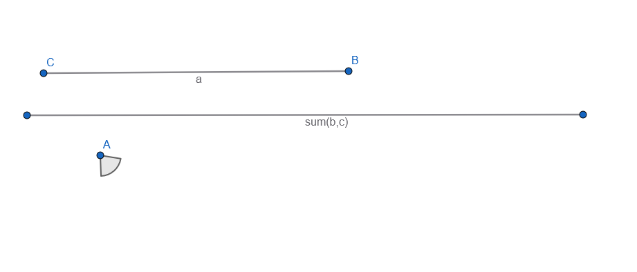

    Same same of question 3, using the complement of the angle, we get the circumcircle of BCY, that defined one of the circunferences where A is located.

    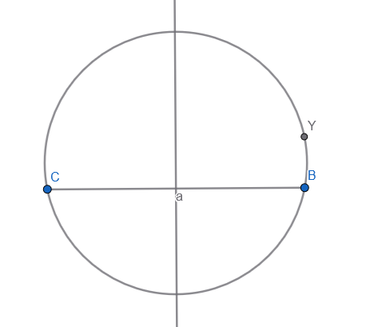

    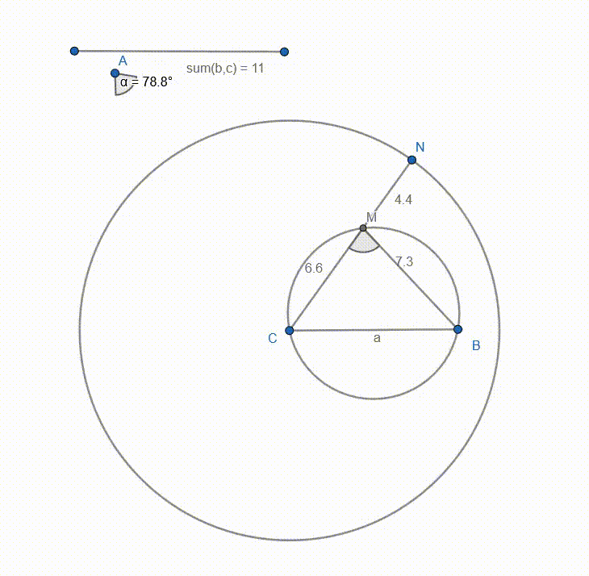